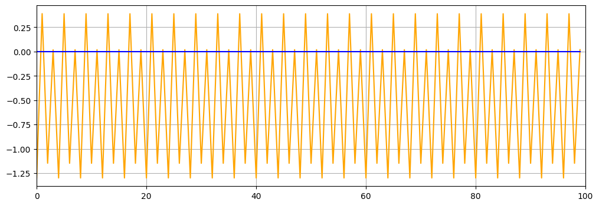

[](https://travis-ci.com/josecelano/mandelbrot-orbit)

## Mandelbrot Orbit

This program generates the orbit for a given Mandelbrot point. Something like:



That's the orbit of point (-1.3,0) which has period 4.

### Math

This is the Mnadelbrot Set basic formula:

```
f(z) = z² + c
```

where `z` and `c` are complex number. 

The Mandelbrot set is the set of complex numbers `c` for which the function does not diverge when iterated from z=0.
Than means, given a `c` complex number, if you apply the formula to that number `n` times using the previous result as the new `z` number, that `c` belongs to Mandelbrot Set if the sequence does not diverge.

This python script plots the series for a given complex point.

### Prerequisites

```
Python 3.6.9
Pillow 7.0.0
pytest-5.3.5
```

### Dev setup

```bash
./bin/dev-setup
```

### Running the tests

```bash
./bin/test
```

### Run with docker

```bash
./bin/run '-0.1' '0.7' 100
```

### Run

```
python3 ./mandelbrot-orbit.py '{ZX}' '{ZY}' {NUM_ITERATIONS}
python3 ./mandelbrot-orbit.py '-0.1' '0.7' 100
```

The script generates an image in root folder: `mandelbrot-orbit.png`

### Troubleshooting

You could see this error:
```
/home/josecelano/.local/lib/python3.6/site-packages/matplotlib/backends/backend_gtk3.py:195: Warning: Source ID 8 was not found when attempting to remove it
  GLib.source_remove(self._idle_draw_id)
```
It seems to be a known issue pending to release:

https://stackoverflow.com/questions/29540845/how-can-i-deactivate-warning-source-id-510-was-not-found-when-attempting-to-re

### TODO

* Although calculations are done with arbitrary precision library the `matplotlib` package uses a float type for data source so we cannot plot point with greater precision than float precision.
